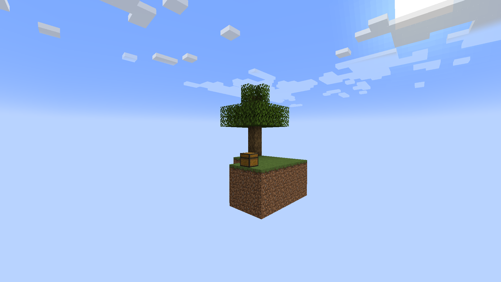

# SkyblockGen *\[Fabric\]*

## Overview

This is a small mod which allows the generation of Skyblock worlds while preserving biomes. Currently it only works for the overworld dimension.
At the moment, the mod also lacks support for modded biomes at spawn because the island structure can only spawn in vanilla biomes.

## Dependencies

The mod depends on Fabric API.

## What's next?

- Configuration
- Multi-dimension support
- Support for modded biomes at spawn
- Custom Islands *(technically possible if you replace the structure in a datapack)*
- Custom spawnpoint